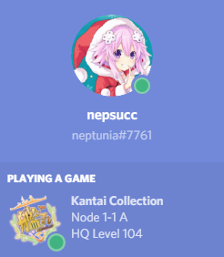
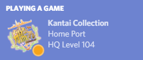

KC to Discord Relayer
=====================

Have you ever played Kancolle, then got depressed that Discord only showed a sad little question mark next to the game, instead of a glorious Kancolle icon? Fear not - introducing: 

# Rich Presence Integration for Kancolle!

What it looks like:

## Requirements

* nodejs
* all its npm requirements
* Google Chrome
* Discord
* KC3Kai
	- This won't work if you don't use KC3Kai, unless you leave the devtools panel open. This is because it uses devtools functionality that only works when the devtools panel is open. If you use KC3Kai, you already have it open!

## Features

* What map/node you're playing on (if any)
* Whether you're in PVP or not
* HQ level
* Idle/Active indicator
* Kancolle icon (very important!)
* its actually useless tho and hard to use

## Usage/Installation

1. install nodejs and dependencies `npm install`
2. change chrome to developer mode (chrome://extensions -> developer mode)
3. Load unpacked extension...
4. Navigate to this directory and click `extension_part`
5. Open terminal/cmd.
6. In the directory of main.js, run `npm run start`
7. Hope it works :^)

Note: If you already have Kancolle or KC3Kai open, you may need to restart Kancolle. Make sure you close your devtools panel and reopen it.

## Contact

Feel free to add an issue or something if something broke/is bugged. Also I have no idea if this will work if you use someone else's discord app. I don't actually know if all the stuff works. Also feel free to put requests and stuff.
