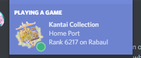

KC to Discord Relayer
=====================

Have you ever played Kancolle, then got depressed that Discord only showed a sad little question mark next to the game, instead of a glorious Kancolle icon? Fear not - introducing: 

# Rich Presence Integration for Kancolle!

What it looks like:

### Old versions

## Requirements

* git
* nodejs
* all its npm requirements
* Google Chrome
* Discord
* KC3Kai
	- This technically doesn't require KC3Kai, but it works best if you use it. This is because it uses devtools functionality that only works when the devtools panel is open. If you use KC3Kai, you already have it open! Otherwise, you'll need to open your devtools panel while playing Kancolle.

## Features

* What map/node you're playing on (if any)
* Rank/Server (you need to check the ranking page though) (Currently either does not work on non-english locales or there is some other spooky bug causing issues)
* Whether you're in PVP or not
* HQ level
* Idle/Active indicator
* Kancolle icon (very important!)
* its actually useless tho and hard to set up
	- although once its set up its pretty easy to use just `npm run start`

## Usage/Installation

1. Either download this repository as zip or git clone it (you'll need to install git either way)
2. install nodejs, git, and dependencies
	- https://nodejs.org/en/
	- https://git-scm.com/downloads
	- then go into `kc-discord-relayer` folder (where `package.json` is) and run `npm install`
3. change chrome to developer mode (chrome://extensions -> developer mode)
4. Load unpacked extension...
5. Navigate to this directory and click `extension_part`
6. Open terminal/cmd.
7. In the directory of main.js, run `npm run start`
8. Hope it works :^)

Note: If you already have Kancolle or KC3Kai open, you may need to restart Kancolle. Make sure you close your devtools panel and reopen it.

Note 2: I've looked into consolidating the whole program into a single chrome extension, but seems like it isn't possible to communicate with the discord rpc api without IPC (which can't be done in the browser) or websockets (which requires whitelisting of my app).

## Updating

* `git pull`
* To update the chrome extension, go to `chrome://extensions` and hit "reload extension"

## TODO

* change hover text on the large icon to `<admiral name> (HQ Level <level>)` DONE
* replace bottom line to something else (maybe composition of current fleet) DONE

## Bugs

* If you're using non-english locale retrieving rank may not work (due to \ being interpreted as they yen symbol I believe). plan to fix this soon (tm).

## Contact

Feel free to add an issue or something if something broke/is bugged. Also I have no idea if this will work if you use someone else's discord app. I don't actually know if all the stuff works. Also feel free to put requests and stuff.

## thanks

* Abukuмæме#8716 for finding bug :^)
* kcdiscord for moral support :)