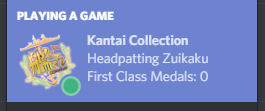
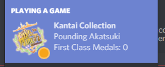
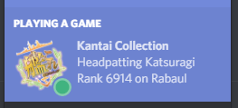

KC to Discord Relayer
=====================

Have you ever played Kancolle, then got depressed that Discord only showed a sad little question mark next to the game, instead of a glorious Kancolle icon? Fear not - introducing: 

# Rich Presence Integration for Kancolle!

What it looks like:

Note: displaying rank can be toggled, and will only show up after you have already checked your rank.

### Old versions

## Requirements

* git
* nodejs
* all its npm requirements
* Google Chrome
* Discord
* KC3Kai
	- This technically doesn't require KC3Kai, but it works best if you use it. This is because it uses devtools functionality that only works when the devtools panel is open. If you use KC3Kai, you already have it open! Otherwise, you'll need to open your devtools panel while playing Kancolle.

## Features

* What map/node you're playing on (if any)
* Time spent on a node
	- Note: there is apparently a discord bug that time elapsed for you may show up wildly incorrect. Do not worry, it shows up on others' computers just fine. Apparently you do not receive rich presence time updates for yourself or something in the Discord API.
* Rank/Server (you need to check the ranking page though)
* Whether you're in PVP or not
* HQ level
* Idle/Active indicator
* Kancolle icon (very important!)
* When in home port, you can customize the text. Defaults to `Headpatting <secretary>`, but you can change it.
	- Can also change text for Akashi flagship
* Can show/hide TTK name
	- Note: Settings changed via the extension (custom home port text, TTK name) need to be refreshed multiple times before they show up (i.e. Go to home port, go somewhere else, go back to home port.) I don't know why this occurs, it just does.
* Medals earned
* its actually useless tho and hard to set up
	- although once its set up its pretty easy to use just `npm run start`

## Usage/Installation

1. Either download this repository as zip or git clone it (you'll need to install git either way). If you download the zip, you'll need to unzip it. Either way, you should now have a folder called `kc-discord-relayer`.
2. install nodejs, git, and dependencies
	- https://nodejs.org/en/
	- https://git-scm.com/downloads
	- Double click `firstrun.bat` (on windows). Alternatively go into `kc-discord-relayer` folder (where `package.json` is) and run `npm install`
	- Note: You may get many warnings about uninstalled dependencies. These are optional dependencies for discord.js and can be ignored.
3. change chrome to developer mode (chrome://extensions -> developer mode)
4. Load unpacked extension...
5. Navigate to this directory and click `extension_part`
6. Open terminal/cmd.
7. Run `run.bat` (on windows). Alternatively, in the directory of main.js, run `npm run start`
8. Hope it works :^)

After installation, all you need to run is `npm run start` (in the directory). Make sure discord is already open before running this.

Note: If you already have Kancolle or KC3Kai open, you may need to restart Kancolle. Make sure you close your devtools panel and reopen it.

Note 2: I've looked into consolidating the whole program into a single chrome extension, but seems like it isn't possible to communicate with the discord rpc api without IPC (which can't be done in the browser) or websockets (which requires whitelisting of my app).

## Updating

* `git pull`
* To update the chrome extension, go to `chrome://extensions` and hit "reload extension"
* Note: this tool gets updated fairly often, usually within a few days after a new ship / remodel / event is released. If not, feel free to contact me or submit a PR.

## Bugs

* (fixed i think) If you're using non-english locale retrieving rank may not work (due to \ being interpreted as they yen symbol I believe). plan to fix this soon (tm).

## Contact

If you find bugs ping me on discord, @neptunia#7761. Or feel free to add an issue or something if something broke/is bugged. Also I have no idea if this will work if you use someone else's discord app. I don't actually know if all the stuff works. Also feel free to put requests and stuff.

## thanks

* kcdiscord for moral support and finding bugs :)
* jebzou (and other contribs in future)
